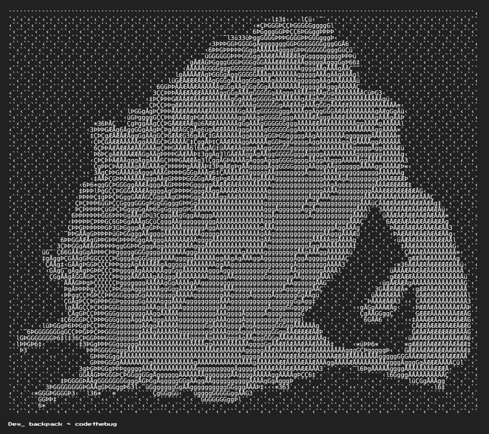

programming funny quotes
=========
[](#contributors-)
[](https://spring.io/projects/spring-boot)
[](https://www.mysql.com/it/)

<a href="https://www.oracle.com/java/" target="_blank" rel="noreferrer">
  
</a>
[](https://www.paypal.com/paypalme/foferys)


## Description:

A simple api that returns a random funny fact about programming on a GET request

### Example Usage

``` 
curl http://localhost:8080/getPhrase/random
```

Response

```json
{
    "data": {
        "id": 24,
        "phrase": "The first rule of debugging: Don’t make it worse.",
        "type": "generic"
    }
}
```


### Advanced Usage

<!-- You can request more than one funny fact at a time by using the GET param `count`

```bash
curl http://localhost:8080/getPhrase/random?count=3
```

Response

```json
{
  "data": [
    "0": 	"Mother cats teach their kittens to use the litter box.",
    "1": "A cat can sprint at about thirty-one miles per hour.",
    "2": "The worlds richest cat is worth $13 million after his human passed away and left her fortune to him."
  ]
}
``` -->

you can retrieve a list of quotes filtered by a specific type (backend, frontend, or generic).


```bash
curl http://localhost:8080/getPhrase/?type=backend  
```

Response

```json
{
    "data": [
        {
            "id": 1,
            "phrase": "Backend developers always say, 'It worked on my local server.'",
            "type": "backend"
        },
        {
            "id": 4,
            "phrase": "Backend developers don’t fear downtime; they fear 'urgent deployments.'",
            "type": "backend"
        }
    ]
}

```

### Dedication

<div align="center">
<p>This API serves up quirky quotes that programmers can’t debug away! </p>
  
  <p>If you enjoy this api, or just love programming, please donate to:</p>
</div>

[](https://www.paypal.com/paypalme/foferys)

## Contributors ✨ 
[](# "Contributors")

<!-- Thanks goes to these wonderful people -->

<!-- prettier-ignore-start -->
<!-- markdownlint-disable -->
<table>
  <tbody>
    <tr>
      <td align="center" valign="top" width="14.28%"><a href="https://github.com/gianpieroferraro"><br /><sub><b>Gianpiero Ferraro</b>(always me lol)</sub></a><br />
      </td>
    </tr>
</tbody>
</table>
